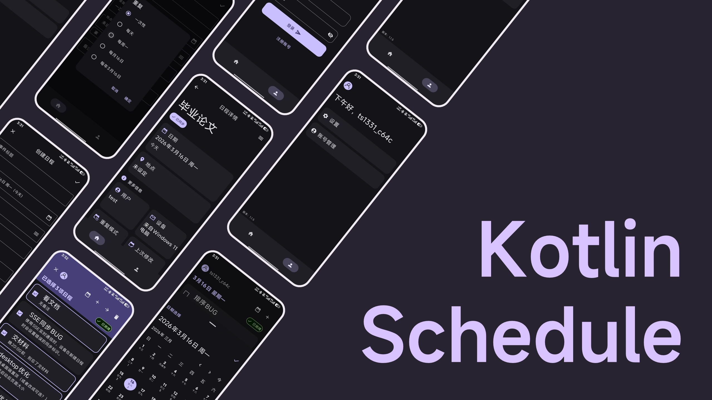
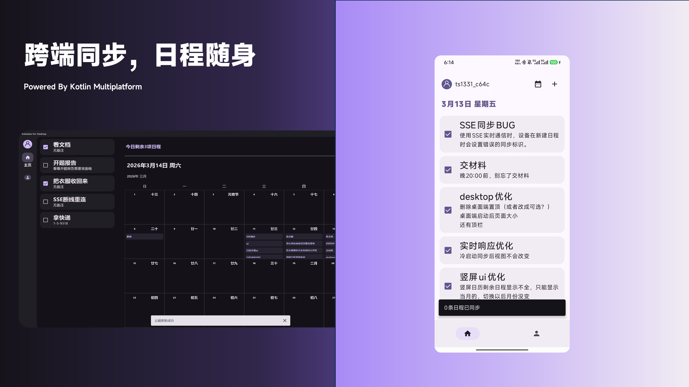

# KotlinSchedule

This is a Kotlin Multiplatform project targeting Android, Desktop.

这是一个基于 Kotlin Multiplatform 的项目，目标是 Android 和 Desktop。此项目可作为个人学习 Kotlin Multiplatform 的项目。

This project is a Kotlin Multiplatform project targeting Android and Desktop. It is intended to be used as a personal project to learn Kotlin Multiplatform.

* `/composeApp` 是一个 Compose Multiplatform 项目，用于共享跨平台应用程序的代码。
  它包含几个子文件夹：
  - `commonMain` 是所有目标共享的代码。
  - 其他文件夹是仅编译为平台指示的文件夹中的 Kotlin 代码。
  例如，`androidMain` 是仅编译为 Android 平台的 Kotlin 代码。
  `desktopMain` 是仅编译为 Desktop 平台的 Kotlin 代码。

* `/composeApp` is for code that will be shared across your Compose Multiplatform applications.
  It contains several subfolders:
  - `commonMain` is for code that’s common for all targets.
  - Other folders are for Kotlin code that will be compiled for only the platform indicated in the folder name.
    For example, if you want to use Apple’s CoreCrypto for the iOS part of your Kotlin app,
    `iosMain` would be the right folder for such calls.

了解更多关于 Kotlin Multiplatform 的信息，请访问 [Kotlin Multiplatform 文档](https://www.jetbrains.com/help/kotlin-multiplatform-dev/get-started.html)。
Learn more about [Kotlin Multiplatform](https://www.jetbrains.com/help/kotlin-multiplatform-dev/get-started.html)…

